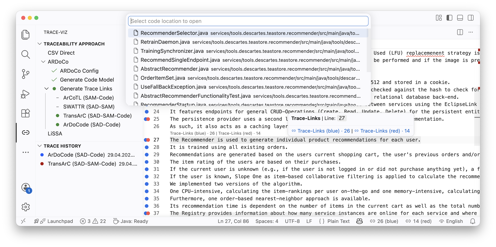

# TraceViz

**TraceViz** is a Visual Studio Code extension that brings software architecture trace links directly into the developer's editing context.
It visualizes links between natural language **Software Architecture Documentation (SAD)** and **source code** as colored gutter markers, enabling one-click navigation from any documentation sentence to the linked code files — and back — without leaving the IDE.



*Colored gutter dots mark SAD-Code trace links. Hovering a line reveals per-set counts and a Quick Pick listing linked code files for one-click navigation. The sidebar shows available TLR approaches and trace history.*

---

## Features

- **Gutter markers** — lines with trace links are annotated with a colored dot; the color identifies the active trace link set
- **Hover tooltips** — hovering a marked line shows the number of linked files per set
- **Quick Pick navigation** — click a gutter dot, CodeLens annotation, or the status bar button to open a Quick Pick list of linked files for one-click navigation
- **Side-by-side comparison** — up to two trace link sets can be loaded simultaneously in distinct colors (e.g., blue for ArDoCode, red for TransArC)
- **Directory heuristic** — when all files in a folder link to the same line, a single directory-level dot replaces per-file markers, reducing visual noise
- **Trace History** — past runs are persisted in a history panel and can be re-activated with one click
- **Multiple trace link sources**:
  - **ARDoCo REST API** — ArDoCode (SAD-Code) and TransArC (SAD-SAM-Code) via [rest.ardoco.de](https://rest.ardoco.de)
  - **LiSSA** — generic RAG-based TLR via a local JAR invocation
  - **CSV Direct** — import trace links from any tool producing the expected format

## Getting Started

### Prerequisites

- Visual Studio Code `^1.100.0`
- (Optional) A [code model extractor JAR](https://github.com/ardoco/code-model-extractor-cli) for generating code models from Java projects

### Running the Extension (Development)

1. **Clone and install dependencies**:
   ```bash
   git clone https://github.com/ardoco/traceviz.git
   cd traceviz
   npm install
   ```

2. **Start the TypeScript compiler in watch mode**:
   ```bash
   npm run watch
   ```

3. **Launch the extension**: press `F5` in VS Code (or **Run → Start Debugging**).
   A new Extension Development Host window opens with TraceViz active.

### Usage

1. **Open a project folder** in VS Code.
2. **Access TraceViz** via the activity bar (chain link icon) — the sidebar shows two panels:
   - **Traceability Approach** — configure and trigger a TLR run
   - **Trace History** — browse and re-activate past results
3. **Choose a trace link source**:
   - **ARDoCo** → configure the REST API endpoint, select a pipeline (ArDoCode or TransArC), and generate trace links
   - **LiSSA** → point to a local LiSSA JAR and run
   - **CSV Direct** → import a CSV file with pre-generated trace links
4. **Navigate** — gutter dots appear on every linked line. Hover for counts, click to open the Quick Pick navigator.

### Configuration

| Setting | Description | Default |
|---|---|---|
| `trace-viz.codeModelExtractorJar` | Path to the [code model extractor JAR](https://github.com/ardoco/code-model-extractor-cli) | *(empty)* |
| `trace-viz.logLevel` | Log verbosity: `DEBUG`, `INFO`, `WARN`, `ERROR` | `INFO` |

## Development

```bash
npm run compile   # one-shot TypeScript build
npm run watch     # continuous rebuild
npm run lint      # ESLint
```

### Project Structure

| Path | Contents |
|---|---|
| [src/commands/](src/commands/) | VS Code command handlers |
| [src/services/](src/services/) | Core services (CSV reader, decoration, path resolver, …) |
| [src/traceabilityApproach/](src/traceabilityApproach/) | Approach implementations: [ardoco/](src/traceabilityApproach/ardoco/), [lissa/](src/traceabilityApproach/lissa/), [csv/](src/traceabilityApproach/csv/) |
| [src/views/](src/views/) | Sidebar view providers |
| [src/visualization/](src/visualization/) | Gutter decoration and line-to-file mapping logic |

## License

See [LICENSE](LICENSE) for details.

## Acknowledgements

TraceViz was initially implemented by Julian Winter as part of his [bachelor's thesis](https://publikationen.bibliothek.kit.edu/1000192928) at KIT.
